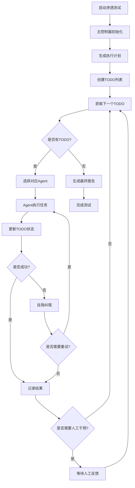
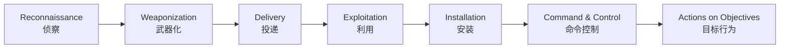

# 🔒 LLM-based Penetration Testing Platform (科研版)

本项目是一个基于 **大语言模型（LLM）** 的渗透测试平台，参考 **Cyber Kill Chain（网络杀伤链）** 全流程，设计用于 **模拟/辅助渗透测试**。

* * *

## ✨ 项目目标

* **研究**：探索 LLM 在渗透测试（PenTest）中可用的推理、规划与工具调用能力。
* **复现**：基于 Cyber Kill Chain 的阶段化工作流，复现真实攻击路径。
* **评测**：设计指标（效率、准确率、误报率、安全性）评估不同模型/提示词策略。

* * *

## 🏗️ 系统架构

### 核心组件架构图

```
┌─────────────────────────────────────────────────────────────┐
│                    Master Controller                        │
│  (主控制器 - 统筹全局，管理TODO，协调各组件)                    │
└─────────────────┬───────────────────────────────────────────┘
                  │
    ┌─────────────┼─────────────┐
    │             │             │
┌───▼───┐    ┌───▼───┐    ┌───▼────┐
│  LLM  │    │ TODO  │    │ Agent  │
│Manager│    │Manager│    │ Tool   │
│       │    │       │    │Manager │
└───────┘    └───────┘    └────────┘
    │             │             │
    │        ┌────▼────┐        │
    │        │ Agents  │        │
    │        │ Layer   │        │
    │        └─────────┘        │
    │                           │
┌───▼─────────────────────────▼───┐
│         Tool Execution          │
│  (Nmap, SQL注入, Web扫描等)      │
└─────────────────────────────────┘
```

### 1. 主控制器 (Master Controller)
- **位置**: `src/core/master_controller.py`
- **职责**: 整个渗透测试的大脑和指挥中心
- **功能**:
  - 统筹管理整个Kill Chain流程
  - 基于TODO列表防止超长执行
  - 协调各个专门Agent
  - 处理人工干预和自我纠错
  - 生成执行计划和总结报告

### 2. LLM管理器 (LLM Manager)
- **位置**: `src/core/llm_manager.py`
- **职责**: 统一管理所有LLM调用
- **功能**:
  - 主模型调用（决策和规划）
  - 分析模型调用（结果分析）
  - Agent模型调用（为各Agent提供LLM服务）
  - 调用统计和错误处理

### 3. TODO管理器 (TODO Manager)
- **位置**: `src/core/todo_manager.py`
- **职责**: 管理任务列表，防止执行超长
- **功能**:
  - 创建和管理TODO列表
  - 任务依赖关系管理
  - 执行时间控制（单任务≤30分钟）
  - 进度跟踪和报告

### 4. Agent工具管理器 (Agent Tool Manager)
- **位置**: `src/core/agent_tool_manager.py`
- **职责**: 为每个Agent提供工具集管理
- **功能**:
  - 私有工具管理（Agent专用）
  - 公有工具管理（所有Agent共享）
  - 工具权限控制
  - 工具使用历史跟踪

### 5. 专门Agents
- **位置**: `src/agents/`
- **职责**: 执行具体的Kill Chain阶段任务
- **组件**:
  - `base_agent.py` - Agent基类，提供统一接口
  - `recon_agent.py` - 侦察阶段Agent
  - `weaponize_agent.py` - 武器化阶段Agent
  - `delivery_agent.py` - 投递阶段Agent
  - `exploit_agent.py` - 利用阶段Agent
  - `install_agent.py` - 安装阶段Agent
  - `c2_agent.py` - 命令控制阶段Agent
  - `objectives_agent.py` - 目标行为阶段Agent
  - `master_agent.py` - 主控Agent

### 6. 支持组件
- `human_intervention.py` - 人工干预管理器
- `self_correction.py` - 自我纠错引擎
- `dynamic_environment.py` - 动态环境管理器
- `agent_communication.py` - Agent间通信系统
- `agent_correction.py` - Agent纠错系统
- `progress_display.py` - 进度显示
- `model_interface.py` - 模型接口

* * *

## 📂 项目结构

```
LLM-based-Penetration-Testing/
├─ starter.py                     # 🚀 启动入口
├─ configs/                       # ⚙️ 配置文件
│  ├─ settings.py                 # 基本配置
│  ├─ hot_swaps.yaml              # 热更新配置
│  ├─ master_controller_config.json # 主控制器配置
│  └─ todo_management_config.json  # TODO管理配置
├─ src/
│  ├─ core/                       # 🧠 核心组件
│  │  ├─ master_controller.py     # 主控制器
│  │  ├─ llm_manager.py           # LLM管理器
│  │  ├─ todo_manager.py          # TODO管理器
│  │  ├─ agent_tool_manager.py    # Agent工具管理器
│  │  ├─ human_intervention.py    # 人工干预管理器
│  │  ├─ self_correction.py       # 自我纠错引擎
│  │  ├─ dynamic_environment.py   # 动态环境管理器
│  │  ├─ agent_communication.py   # Agent间通信
│  │  ├─ agent_correction.py      # Agent纠错系统
│  │  ├─ progress_display.py      # 进度显示
│  │  └─ model_interface.py       # 模型接口
│  ├─ agents/                     # 🤖 智能Agents
│  │  ├─ base_agent.py            # Agent基类
│  │  ├─ master_agent.py          # 主控Agent
│  │  ├─ recon_agent.py           # 侦察Agent
│  │  ├─ weaponize_agent.py       # 武器化Agent
│  │  ├─ delivery_agent.py        # 投递Agent
│  │  ├─ exploit_agent.py         # 利用Agent
│  │  ├─ install_agent.py         # 安装Agent
│  │  ├─ c2_agent.py              # C2 Agent
│  │  └─ objectives_agent.py      # 目标行为Agent
│  ├─ tools/                      # 🔧 工具层
│  │  ├─ public/                  # 公有工具
│  │  │  └─ nmap_tool.py          # Nmap工具
│  │  ├─ private/                 # 各Agent私有工具
│  │  │  ├─ recon_agent/
│  │  │  ├─ exploit_agent/
│  │  │  └─ ...
│  │  ├─ shared/                  # 共享工具（已移除）
│  │  └─ nmap_adapter.py          # Nmap适配器
│  ├─ prompts/                    # 📝 提示词管理
│  │  ├─ __init__.py              # 提示词管理器
│  │  ├─ master_prompts.py        # 主控制器提示词
│  │  ├─ agent_prompts.py         # Agent提示词
│  │  └─ recon_prompts.py         # 侦察提示词
│  ├─ service/                    # 🌐 API服务
│  │  ├─ master_controller_api.py # 主控制器API
│  │  ├─ scan_api.py              # 扫描API
│  │  ├─ exploit_api.py           # 利用API
│  │  ├─ payload_api.py           # 载荷API
│  │  ├─ report_api.py            # 报告API
│  │  └─ model_manager.py         # 模型服务管理
│  ├─ database/                   # 💾 数据存储
│  │  ├─ database.py              # 数据库管理
│  │  ├─ logging_service.py       # 日志服务
│  │  └─ models.py                # 数据模型
│  ├─ orchestrator/               # 🎭 编排器
│  │  ├─ killchain_orchestrator.py # Kill Chain编排器
│  │  └─ states.py                # 状态定义
│  ├─ schemas/                    # 📋 数据模式
│  │  ├─ common.py                # 通用模式
│  │  └─ ...
│  └─ utils/                      # 🛠️ 工具函数
│     ├─ logger.py                # 日志工具
│     ├─ cmd_executer.py          # 命令执行器
│     └─ ...
├─ pentest_events/                # 📊 测试事件记录
├─ logs/                          # 📜 日志输出
└─ README.md
```

* * *

## 🔄 任务执行流程

### 1. 整体执行流程



### 2. Kill Chain 执行阶段



每个阶段的具体功能：

1. **Reconnaissance（侦察）**
   - 端口扫描（Nmap）
   - 服务识别和版本探测
   - 子域名枚举
   - DNS信息收集
   - Web应用指纹识别

2. **Weaponization（武器化）**
   - 漏洞分析和评估
   - 攻击载荷选择
   - 自定义工具开发
   - 利用代码准备

3. **Delivery（投递）**
   - 攻击向量选择
   - 载荷投递方法
   - 社会工程学策略

4. **Exploitation（利用）**
   - 漏洞利用执行
   - 权限提升
   - 防御绕过

5. **Installation（安装）**
   - 持久化机制安装
   - 后门部署
   - 防检测技术

6. **Command & Control（命令控制）**
   - C2通信建立
   - 隐蔽通道配置
   - 心跳机制

7. **Actions on Objectives（目标行为）**
   - 数据收集
   - 横向移动
   - 权限维持

### 3. TODO管理机制

为防止超长执行，系统采用TODO管理机制：

- **任务分解**: 超过30分钟的任务自动分解为子任务
- **依赖管理**: 任务间依赖关系自动处理
- **超时控制**: 单个任务最长30分钟，总执行时间最长1小时
- **并行执行**: 支持最多3个任务并行执行
- **失败处理**: 失败率超过80%时自动停止

* * *

## 🚀 使用流程

### 1. 环境准备

```bash
# 克隆项目
git clone <repository-url>
cd LLM-based-Penetration-Testing

# 安装依赖
pip install -r requirements.txt

# 配置环境变量
cp env.example .env
# 编辑 .env 文件，配置LLM API密钥等
```

### 2. 配置管理

#### 主控制器配置 (`configs/master_controller_config.json`)
```json
{
  "master_model": {
    "base_url": "http://localhost:8000",
    "model_name": "gpt-4",
    "temperature": 0.7,
    "max_tokens": 4096
  },
  "todo_management": {
    "max_todo_execution_time": 1800,
    "todo_timeout_threshold": 3600,
    "max_parallel_todos": 3
  },
  "safety": {
    "safe_mode": true,
    "require_authorization": true
  }
}
```

#### 热更新配置 (`configs/hot_swaps.yaml`)
```yaml
pentest:
  safe_mode: true
  active_exploration: false
  
llm:
  request:
    timeout: 60
    max_tokens: 4096
    temperature: 0.7
```

### 3. 启动服务

```bash
# 启动主服务
python starter.py --model_name PenTest-LLM --service_port 8080

# 或使用Docker
docker-compose up -d
```

### 4. API调用示例

#### 启动渗透测试
```bash
curl -X POST "http://localhost:8080/api/v1/master/start" \
  -H "Content-Type: application/json" \
  -d '{
    "target": "example.com",
    "options": {
      "scan_depth": "standard",
      "timeout": 3600
    },
    "safe_mode": true
  }'
```

#### 获取执行状态
```bash
curl "http://localhost:8080/api/v1/master/status"
```

#### 获取TODO列表
```bash
curl "http://localhost:8080/api/v1/master/todos"
```

### 5. 人工干预

当系统检测到需要人工干预时：

```bash
# 获取待处理的干预请求
curl "http://localhost:8080/api/v1/master/interventions"

# 提供人工反馈
curl -X POST "http://localhost:8080/api/v1/master/intervention/feedback" \
  -H "Content-Type: application/json" \
  -d '{
    "intervention_id": "xxx",
    "feedback": {
      "approve": true,
      "modifications": {}
    }
  }'
```

* * *

## 📊 监控和报告

### 1. 实时监控

- **进度跟踪**: 实时查看TODO执行进度
- **性能监控**: LLM调用统计、执行时间监控
- **错误监控**: 失败任务和错误信息跟踪

### 2. 报告生成

系统自动生成以下报告：

- **执行总结**: 整体测试结果和统计
- **TODO报告**: 详细的任务执行记录
- **漏洞报告**: 发现的安全问题清单
- **技术报告**: 使用的工具和方法记录

### 3. 评测指标

- **完成率**: TODO完成百分比
- **成功率**: 任务执行成功率
- **效率**: 平均任务执行时间
- **准确率**: 发现漏洞的准确性
- **安全性**: 违规操作次数（应为0）

* * *

## ⚙️ 高级配置

### 1. LLM模型配置

支持多种LLM模型：
- OpenAI GPT系列
- Anthropic Claude
- 本地部署模型
- 国产大模型

### 2. 工具扩展

添加新工具的步骤：

1. 继承 `ToolInterface` 基类
2. 实现必要的方法
3. 配置工具作用域（PUBLIC/PRIVATE）
4. 注册到相应的Agent

### 3. Agent扩展

添加新Agent的步骤：

1. 继承 `BaseAgent` 基类
2. 实现 `execute` 方法
3. 配置Agent工具集
4. 编写专门的提示词

* * *

## ⚠️ 安全注意事项

### 1. 授权要求
- **仅限授权目标**: 禁止对未授权系统进行测试
- **书面授权**: 确保有明确的测试授权文档
- **范围限制**: 严格控制测试范围和深度

### 2. 安全模式
- **默认开启**: Safe Mode默认启用，禁止破坏性操作
- **隔离环境**: 建议在隔离的测试环境中运行
- **监控审计**: 全程记录操作日志，便于审计

### 3. 数据保护
- **敏感信息**: 不在日志中记录敏感数据
- **传输加密**: API通信使用HTTPS
- **存储安全**: 测试结果安全存储和销毁

* * *

## 🔬 科研应用

### 1. 研究方向
- LLM在网络安全领域的应用能力评估
- 自动化渗透测试的可行性研究
- 人工智能与网络安全的结合研究

### 2. 评测框架
- 多模型对比测试
- 提示词工程效果评估
- 安全性和可靠性评估

### 3. 数据收集
- 详细的执行日志
- 性能指标统计
- 错误和异常记录

* * *

## 🚀 后续扩展

### 1. 功能扩展
- 支持更多渗透测试工具
- 增强的人工智能决策能力
- 自动化报告生成

### 2. 平台扩展
- Web界面支持
- 移动端应用
- 云服务部署

### 3. 集成扩展
- 与主流安全工具集成
- SIEM系统对接
- 威胁情报集成

* * *

## 📞 联系和支持

如有问题或建议，请通过以下方式联系：

- 提交Issue到项目仓库
- 发送邮件到维护团队
- 参与项目讨论组

---

**免责声明**: 本项目仅供学习和科研使用，使用者应遵守相关法律法规，不得用于非法用途。