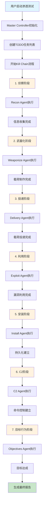
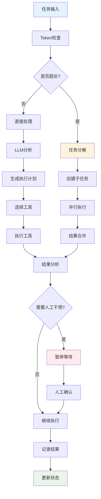
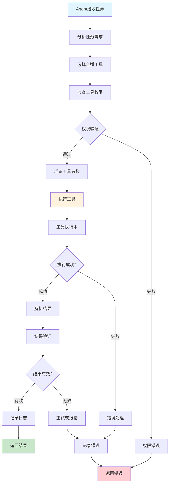
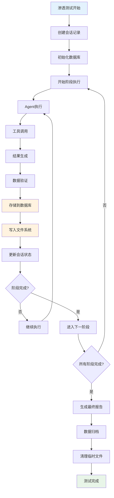
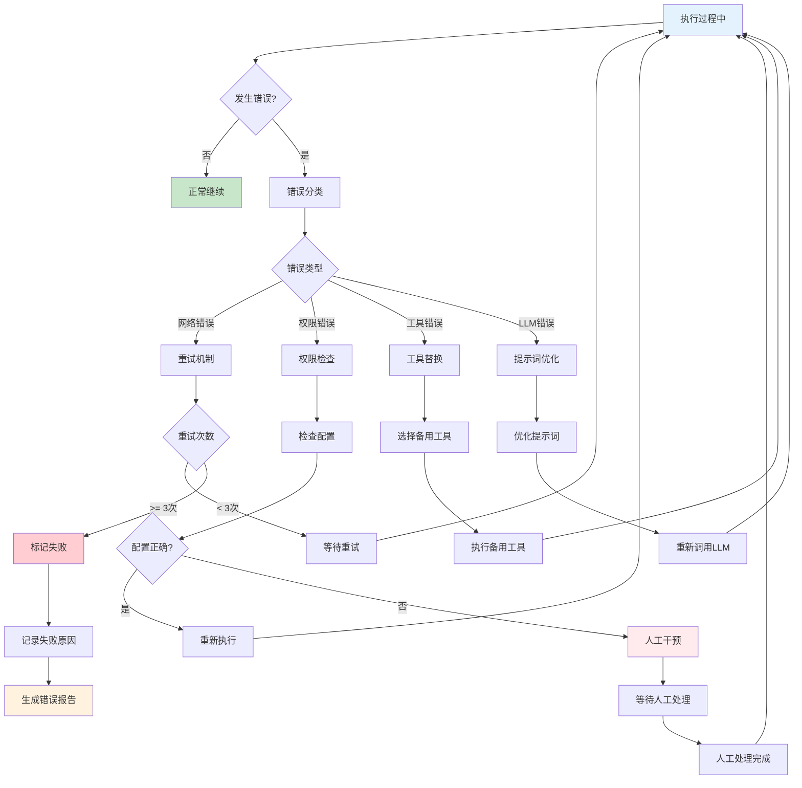

# 🔒 LLM-based Penetration Testing Platform

基于大语言模型（LLM）的渗透测试平台，采用Cyber Kill Chain（网络杀伤链）框架，实现智能化的渗透测试流程。

## ✨ 项目特色

- **🤖 LLM驱动**: 使用大语言模型进行智能决策和任务规划
- **🔗 Kill Chain**: 完整的网络杀伤链流程实现
- **🛠️ 工具集成**: 丰富的渗透测试工具集成
- **📊 数据记录**: 完整的测试过程记录和分析
- **🐳 容器化**: Docker容器化部署，安全隔离
- **🔄 热更新**: 支持配置热更新，无需重启

## 🏗️ 系统架构

### 核心架构图

```
┌─────────────────────────────────────────────────────────────┐
│                    Master Controller                        │
│  (主控制器 - 统筹全局，管理TODO，协调各组件)                    │
└─────────────────┬───────────────────────────────────────────┘
                  │
    ┌─────────────┼─────────────┐
    │             │             │
┌───▼───┐    ┌───▼───┐    ┌───▼────┐
│  LLM  │    │ TODO  │    │ Agent  │
│Manager│    │Manager│    │ Tool   │
│       │    │       │    │Manager │
└───────┘    └───────┘    └────────┘
    │             │             │
    │        ┌────▼────┐        │
    │        │ Agents  │        │
    │        │ Layer   │        │
    │        └─────────┘        │
    │                           │
┌───▼─────────────────────────▼───┐
│         Tool Execution          │
│  (Nmap, 解码, 命令执行等)        │
└─────────────────────────────────┘
```

## 🔄 核心工作流程

### 1. 渗透测试主流程



### 2. LLM决策流程



### 3. Agent工具调用流程



### 4. 数据流和存储流程



### 5. 错误处理和恢复流程



## 🎯 设计思路说明

### 1. **分层架构设计**
- **控制层**: Master Controller作为核心调度器
- **服务层**: LLM Manager、TODO Manager、Tool Manager提供核心服务
- **执行层**: 各专业Agent负责具体任务执行
- **工具层**: 丰富的工具集支持各种渗透测试需求

### 2. **状态机驱动**
- 基于Cyber Kill Chain的7个阶段状态
- 每个状态对应专门的Agent和工具集
- 状态转换由LLM智能决策驱动

### 3. **异步并发处理**
- 支持多任务并行执行
- 异步I/O提高执行效率
- 任务队列管理避免资源冲突

### 4. **容错和恢复机制**
- 多层次的错误处理
- 自动重试和降级策略
- 人工干预和确认机制

### 5. **数据完整性保证**
- 完整的执行记录和审计日志
- 结构化数据存储便于分析
- 实时状态同步和监控

## 📁 项目结构

```
LLM-based-Penetration-Testing/
├─ 📋 README.md                    # 项目说明
├─ 🐳 Dockerfile                   # Docker镜像构建
├─ 🐳 docker-compose.yml           # 容器编排
├─ 📦 requirements.txt             # Python依赖
├─ 🚀 starter.py                   # 启动入口
├─ 📄 LICENSE                      # 开源协议
│
├─ 📁 configs/                     # 配置文件
│  ├─ settings.py                  # 基础配置
│  ├─ master_controller_config.json # 主控制器配置
│  └─ hot_swaps.yaml              # 热更新配置
│
├─ 📁 scripts/                     # 脚本文件
│  └─ start.sh                    # 启动脚本
│
├─ 📁 utils/                       # 项目级工具
│  ├─ __init__.py
│  └─ hot_swap_watcher.py         # 热更新监控
│
├─ 📁 pentest_events/              # 📊 测试事件记录
│  ├─ db/                         # 数据库文件
│  ├─ files/                      # 事件文件
│  │  ├─ scans/                   # 扫描结果
│  │  ├─ exploits/                # 利用输出
│  │  ├─ payloads/                # 生成的载荷
│  │  └─ reports/                 # 生成的报告
│  └─ README.md                   # 事件目录说明
│
└─ 📁 src/                         # 源代码
   ├─ 📁 agents/                   # 🤖 Agent层
   │  ├─ __init__.py
   │  ├─ base_agent.py            # Agent基类
   │  ├─ master_agent.py          # 主Agent
   │  ├─ recon_agent.py           # 侦察Agent
   │  ├─ weaponize_agent.py       # 武器化Agent
   │  ├─ delivery_agent.py        # 投递Agent
   │  ├─ exploit_agent.py         # 利用Agent
   │  ├─ install_agent.py         # 安装Agent
   │  ├─ c2_agent.py              # C2 Agent
   │  └─ objectives_agent.py      # 目标Agent
   │
   ├─ 📁 core/                     # 🧠 核心组件
   │  ├─ __init__.py
   │  ├─ master_controller.py     # 主控制器
   │  ├─ llm_manager.py           # LLM管理器
   │  ├─ agent_tool_manager.py    # Agent工具管理器
   │  ├─ todo_manager.py          # TODO管理器
   │  ├─ model_interface.py       # 模型接口
   │  ├─ agent_communication.py   # Agent通信
   │  ├─ agent_correction.py      # Agent纠错
   │  ├─ human_intervention.py    # 人工干预
   │  ├─ self_correction.py       # 自我纠错
   │  └─ dynamic_environment.py   # 动态环境管理
   │
   ├─ 📁 database/                 # 🗄️ 数据存储
   │  ├─ __init__.py
   │  ├─ database.py              # 数据库管理
   │  ├─ models.py                # 数据模型
   │  └─ logging_service.py       # 日志服务
   │
   ├─ 📁 orchestrator/             # 🎭 流程编排
   │  ├─ __init__.py
   │  └─ states.py                # 状态定义
   │
   ├─ 📁 prompts/                  # 📝 提示词管理
   │  ├─ __init__.py
   │  ├─ master_prompts.py        # 主模型提示词
   │  └─ agent_prompts.py         # Agent提示词
   │
   ├─ 📁 schemas/                  # 📋 数据模型
   │  ├─ __init__.py
   │  └─ common.py                # 通用数据模型
   │
   ├─ 📁 service/                  # 🌐 API服务
   │  ├─ __init__.py
   │  ├─ master_controller_api.py # 主控制器API
   │  ├─ model_manager.py         # 模型服务管理
   │  ├─ scan_api.py              # 扫描API
   │  ├─ exploit_api.py           # 利用API
   │  ├─ payload_api.py           # 载荷API
   │  ├─ report_api.py            # 报告API
   │  └─ mapping/                 # 映射服务
   │     ├─ __init__.py
   │     └─ header_param_mapping.py # 头部参数映射
   │
   ├─ 📁 tools/                    # 🛠️ 工具集
   │  ├─ __init__.py
   │  ├─ public/                  # 公共工具
   │  │  ├─ __init__.py
   │  │  ├─ nmap_tool.py          # Nmap扫描工具
   │  │  ├─ auto_decode.py        # 智能解码工具
   │  │  └─ cmd_executer.py       # 命令执行工具
   │  └─ private/                 # 私有工具
   │     ├─ __init__.py
   │     ├─ recon_agent/          # 侦察Agent工具
   │     │  ├─ __init__.py
   │     │  └─ subdomain_tool.py  # 子域名工具
   │     ├─ exploit_agent/        # 利用Agent工具
   │     │  ├─ __init__.py
   │     │  └─ sql_injection_tool.py # SQL注入工具
   │     └─ [其他Agent工具目录]
   │
   └─ 📁 utils/                    # 🔧 工具函数
      ├─ __init__.py
      ├─ logger.py                 # 日志工具
      ├─ token_manage.py           # Token管理
      ├─ thread_local_storage.py   # 线程本地存储
      └─ llm_tokenizer/            # LLM分词器
         ├─ qwen.llm
         ├─ tokenization_llm.py
         └─ tokenizer_config.json
```

## 🚀 快速开始

### 环境要求

- Python 3.8+
- Docker & Docker Compose
- 8GB+ RAM (推荐)

### 1. 克隆项目

```bash
git clone <repository-url>
cd LLM-based-Penetration-Testing
```

### 2. 配置环境

```bash
# 复制环境配置
cp env.example .env

# 编辑配置文件
vim configs/master_controller_config.json
```

### 3. 安装依赖

```bash
# 使用Docker (推荐)
docker-compose up -d

# 或本地安装
pip install -r requirements.txt
```

### 4. 启动服务

```bash
# Docker方式
docker-compose up

# 本地方式
python starter.py
```

## ⚙️ 配置说明

### LLM API配置

在 `configs/master_controller_config.json` 中配置您的LLM API：

```json
{
  "llm_models": {
    "master_model": {
      "base_url": "https://api.openai.com/v1",
      "api_key": "your-api-key",
      "model_name": "gpt-4",
      "temperature": 0.7,
      "max_tokens": 4096
    },
    "analysis_model": {
      "base_url": "https://api.openai.com/v1", 
      "api_key": "your-api-key",
      "model_name": "gpt-3.5-turbo",
      "temperature": 0.3,
      "max_tokens": 2048
    }
  }
}
```

### 支持的LLM服务

- **OpenAI**: GPT-4, GPT-3.5-turbo
- **Claude**: Claude-3, Claude-2
- **本地模型**: Ollama, vLLM等
- **其他**: 兼容OpenAI API格式的服务

### 环境变量配置

```bash
# .env文件示例
DATABASE_URL=sqlite:///./pentest_events/pentest.db
LOG_LEVEL=INFO
MAX_THREAD=4
SERVICE_NAME=llm-pen-test
```

## 🎯 使用指南

### 1. 启动渗透测试

```python
from src.core.master_controller import MasterController

# 初始化控制器
controller = MasterController(config)
await controller.initialize()

# 开始渗透测试
result = await controller.start_pentest(
    target="192.168.1.100",
    safe_mode=True
)
```

### 2. 自定义Agent

```python
from src.agents.base_agent import BaseAgent

class CustomAgent(BaseAgent):
    def __init__(self, config):
        super().__init__(AgentType.CUSTOM, config)
    
    async def execute(self, target_info, context):
        # 实现自定义逻辑
        return {"success": True, "result": "..."}
```

### 3. 添加工具

```python
from src.core.agent_tool_manager import ToolInterface

class CustomTool(ToolInterface):
    def __init__(self, config):
        super().__init__("custom_tool", config)
    
    async def execute(self, parameters, context):
        # 实现工具逻辑
        return {"success": True, "result": "..."}
```

## 🔧 核心功能

### 1. 智能任务规划

- **TODO管理**: 自动分解复杂任务，防止超长执行
- **并行处理**: 支持多任务并行执行
- **错误恢复**: 自动重试和错误处理

### 2. 工具集成

- **Nmap扫描**: 端口扫描、服务识别
- **智能解码**: Base64、URL、Unicode、Hex解码
- **命令执行**: 安全的命令执行环境
- **自定义工具**: 支持扩展工具

### 3. 数据管理

- **完整记录**: 记录所有测试步骤和结果
- **结构化存储**: SQLite数据库存储
- **文件管理**: 扫描结果、载荷、报告分类存储

### 4. 安全特性

- **容器隔离**: Docker环境运行
- **权限控制**: 工具执行权限管理
- **审计日志**: 完整的操作审计

## 📊 监控和分析

### 1. 实时监控

- **进度显示**: 实时显示测试进度
- **状态跟踪**: Kill Chain各阶段状态
- **性能指标**: 执行时间和成功率

### 2. 报告生成

- **HTML报告**: 可视化测试报告
- **JSON数据**: 结构化测试数据
- **漏洞统计**: 漏洞发现和分类统计

## 🛡️ 安全考虑

### 1. 容器安全

- **网络隔离**: 容器网络隔离
- **资源限制**: CPU和内存限制
- **只读文件系统**: 防止恶意修改

### 2. 数据安全

- **敏感信息**: 不在日志中记录敏感信息
- **数据加密**: 支持数据加密存储
- **访问控制**: 文件访问权限控制

## 🤝 贡献指南

### 1. 开发环境

```bash
# 安装开发依赖
pip install -r requirements-dev.txt

# 运行测试
pytest tests/

# 代码格式化
black src/
isort src/
```

### 2. 提交规范

- 使用清晰的提交信息
- 添加必要的测试用例
- 更新相关文档

## 📄 许可证

本项目采用 [MIT License](LICENSE) 开源协议。

## 🙏 致谢

- 感谢所有贡献者的支持
- 感谢开源社区的工具和库
- 感谢安全研究社区的指导

---

**⚠️ 免责声明**: 本项目仅用于教育和研究目的，请勿用于非法活动。使用者需遵守当地法律法规。