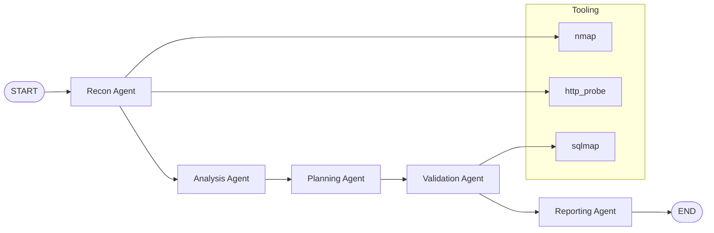

# AutoPentest

AutoPentest is a research platform for multi-agent, automated security assessment in authorized environments. It emphasizes orchestration, evidence chains, reproducibility, and experiment evaluation without exploit payloads or destructive actions outside lab scope.

## Architecture



## Quickstart (Local)

1. Install dependencies:

```bash
pip install -e .[dev]
```

2. Start the lab:

```bash
./scripts/lab_up.sh
```

3. Verify environment:

```bash
python -m autopentest doctor
```

4. Run an assessment:

```bash
python -m autopentest run \
  --target data/targets/dvwa_local.yaml \
  --config configs/dev.yaml \
  --i-understand-and-am-authorized
```

5. Run benchmarks:

```bash
python -m autopentest eval \
  --bench data/benchmarks/lab_benchmark.yaml \
  --config configs/eval.yaml \
  --i-understand-and-am-authorized
```

6. Stop the lab:

```bash
./scripts/lab_down.sh
```

## Quickstart (Docker)

1. Start the lab on the host:

```bash
docker compose -f docker/docker-compose.lab.yml up -d
```

2. Build the AutoPentest image:

```bash
docker build -f docker/Dockerfile -t autopentest .
```

3. Run tests and evaluation (Linux host networking):

```bash
docker run --rm --network host autopentest pytest

docker run --rm --network host autopentest autopentest eval \
  --bench data/benchmarks/lab_benchmark.yaml \
  --config configs/eval.yaml \
  --i-understand-and-am-authorized
```

On non-Linux hosts, update targets to use `host.docker.internal` instead of `127.0.0.1`.

## Outputs

Each run creates:

- `runs/<run_id>/config_resolved.yaml`
- `runs/<run_id>/events.jsonl`
- `runs/<run_id>/evidence/`
- `runs/<run_id>/artifacts/recon.json`
- `runs/<run_id>/artifacts/findings.json` (if any)
- `runs/<run_id>/artifacts/validation_plan.json`
- `runs/<run_id>/artifacts/session.json`
- `runs/<run_id>/summary.json`
- `runs/<run_id>/report.md`

## Add a new agent

1. Create a module in `src/autopentest/agents/`.
2. Implement `run(state, ctx)` and update `graph/workflow.py`.
3. Update `schemas/messages.py` if the state changes.

## Add a new tool

1. Implement a command builder or Python handler in `src/autopentest/tools/builtins.py` or a plugin.
2. Register the tool in `ToolRegistry`.
3. Add parser logic under `src/autopentest/tools/parsers/`.

## Benchmarks

Benchmarks live in `data/benchmarks/` and reference targets by path with a success strategy.

## Development checks

```bash
ruff check .
mypy src
pytest
```

## Notes

- Scope declaration is required on every run (`--i-understand-and-am-authorized`).
- All external commands are allowlisted in `core/safety.py`.
- sqlmap runs in safe detection mode only (no dump/file/OS shell).
