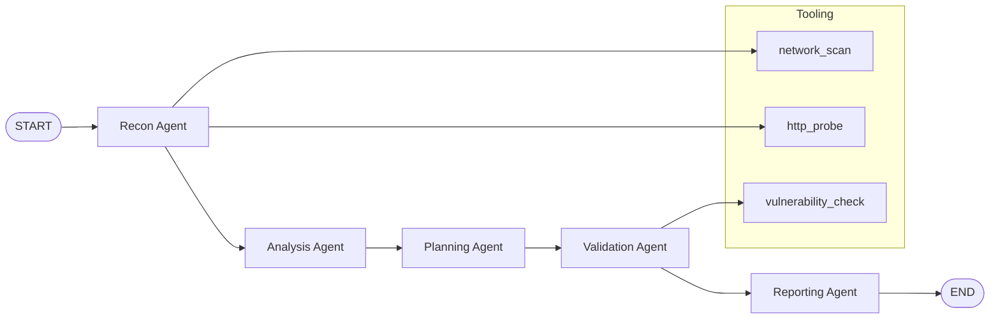

# AutoPentest

AutoPentest is a research platform for multi-agent, automated security assessment in authorized environments. It emphasizes orchestration, evidence chains, reproducibility, and experiment evaluation without exploit payloads or destructive actions.

## Architecture



## Quickstart

```bash
pip install -e .
python -m autopentest doctor

autopentest run \
  --target data/targets/sample_target.yaml \
  --scope data/targets/sample_scope.yaml

autopentest report --run <RUN_ID>

autopentest eval \
  --benchmark data/benchmarks/sample_benchmark.yaml \
  --scope data/targets/sample_scope.yaml
```

## Outputs

- Runs are stored in `runs/<run_id>/`
- Evidence: `runs/<run_id>/evidence/`
- Artifacts: `runs/<run_id>/artifacts/`
- Events: `runs/<run_id>/events.jsonl`
- Report: `runs/<run_id>/report.md`

## Add a new agent

1. Create a new module in `src/autopentest/agents/`.
2. Implement a `run(state, ctx)` function returning state updates.
3. Register the node in `src/autopentest/graph/workflow.py` and connect edges.
4. Update the state schema if new fields are introduced.

## Add a new tool

1. Implement a tool handler in `src/autopentest/tools/builtins.py` or a plugin module.
2. Register it with `ToolRegistry.register`.
3. Reference it from the planning/validation stages.
4. Add any configuration in `configs/default.yaml`.

## Run a benchmark

1. Define a benchmark in `data/benchmarks/*.yaml`.
2. Execute:

```bash
autopentest eval --benchmark data/benchmarks/sample_benchmark.yaml --scope data/targets/sample_scope.yaml
```

## Notes

- Scope declaration is required on every run to enforce authorized assessment.
- The platform does not contain exploit payloads or destructive tooling.
