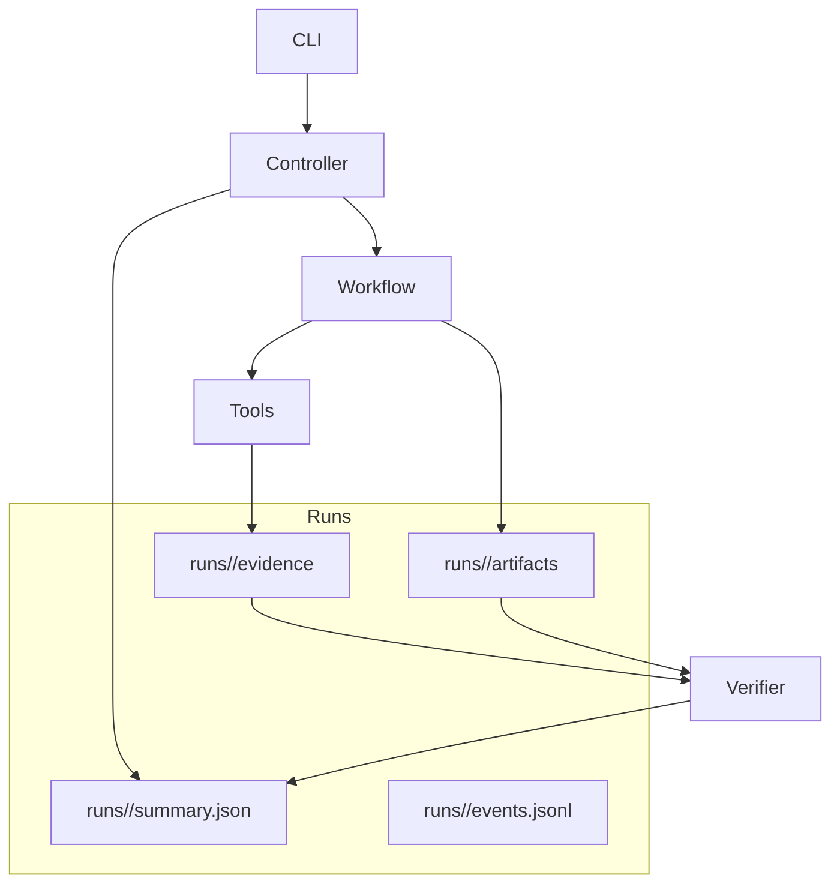

# Architecture

AutoPentest is a research platform for orchestrating multi-agent security assessment workflows with reproducible evidence.

## Modules

- `graph/workflow.py`: LangGraph StateGraph orchestration.
- `agents/*`: recon, analysis, planning, validation, reporting.
- `tools/*`: tool registry, command builders, parsers, and execution runner.
- `core/*`: config, safety, logging, identifiers.
- `orchestrator/controller.py`: run lifecycle, artifacts, summary, and verification.
- `orchestrator/verifier.py`: success rules and doctor checks.
- `evaluation/*`: benchmark execution and metrics.

## Data flow

## Observability

- `events.jsonl` records stage and tool_call events.
- Evidence captures stdout/stderr and parsed output for reproducibility.
- Artifacts contain recon results, validation plans, and session summary.
